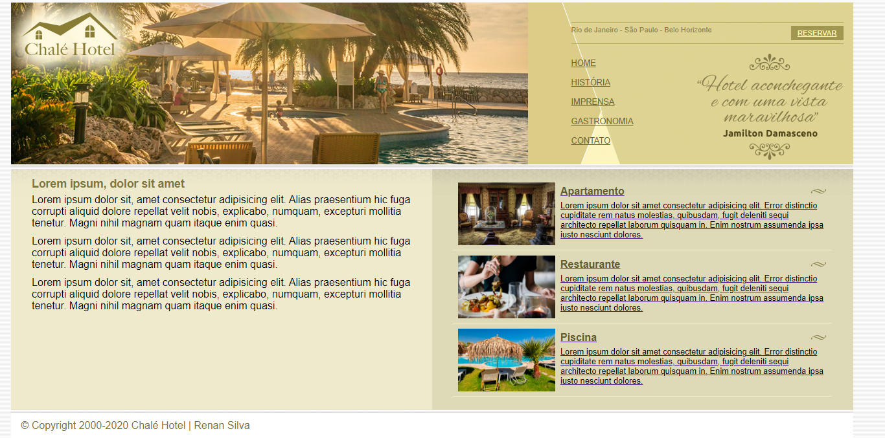
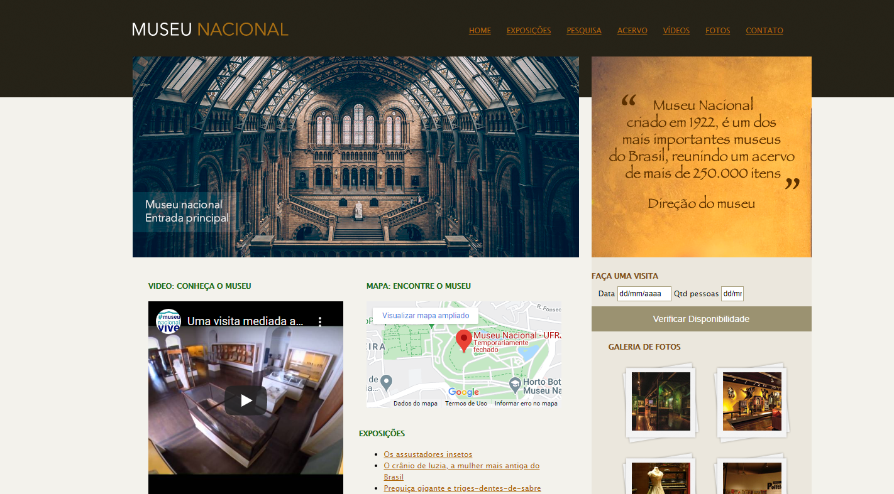
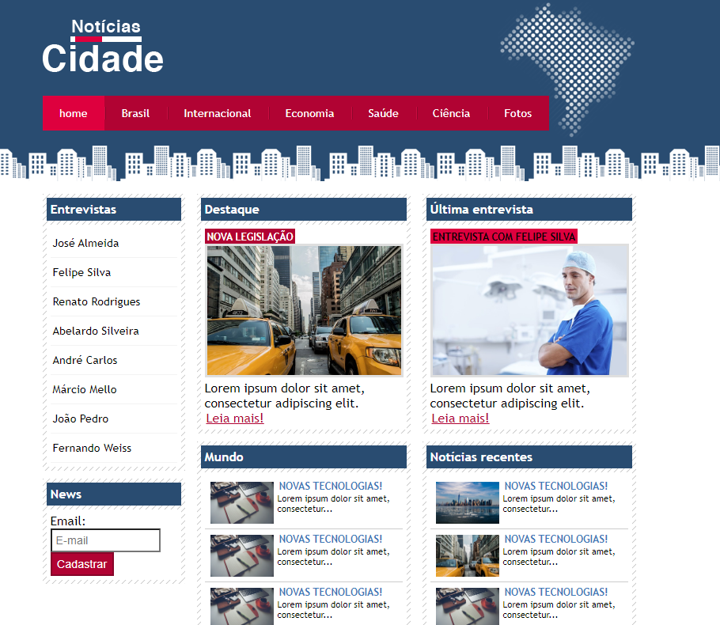
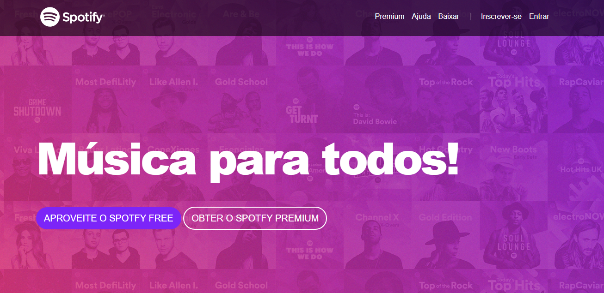
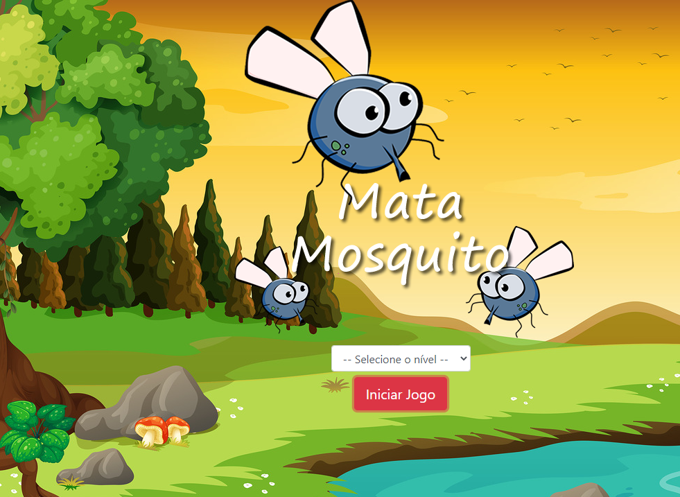

# Estudos no curso sobre Desenvolvimento Web

## Conteudo do curso

* Fundamentos HTML
* CSS do basico ao avançado
* Bootstrap
* JavaScript ES

# Projetos desenvolvidos:
## Páginas fluidas e estáticas

## Paginas Responsivas

## JavaScript

# Curso
[Desenvolvimento Web Completo 2021 - 20 cursos + 20 projetos](https://www.udemy.com/course/web-completo/)